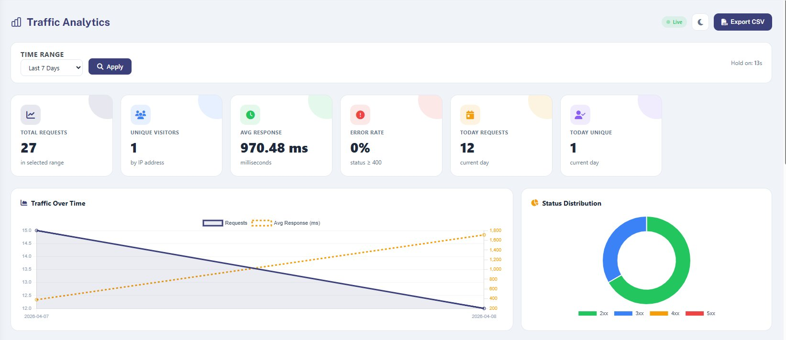
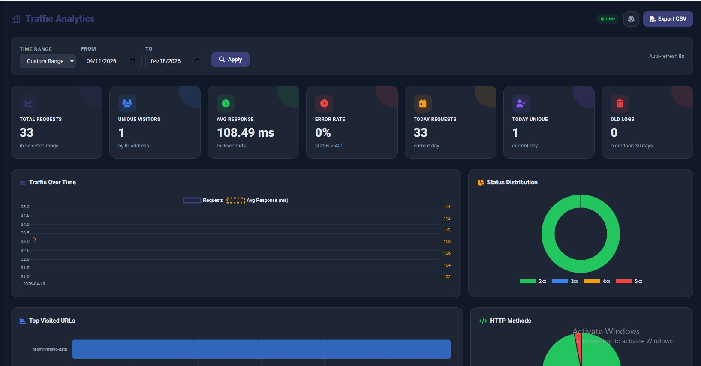
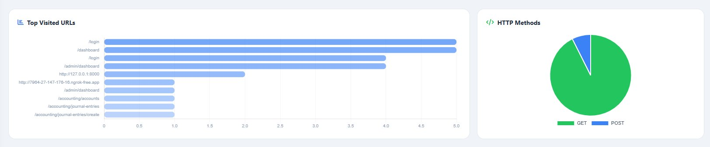
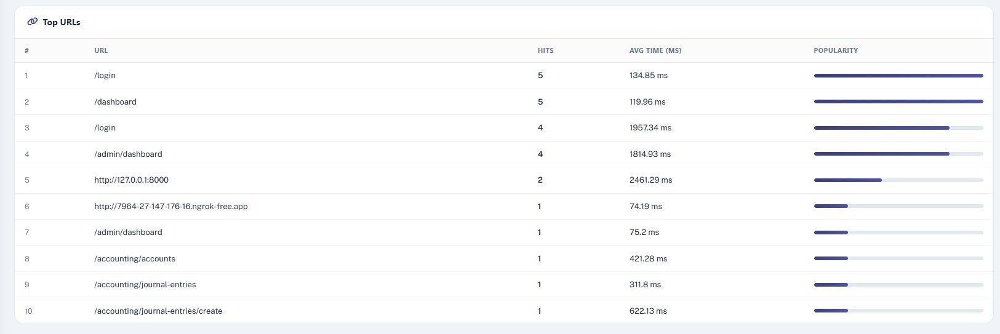
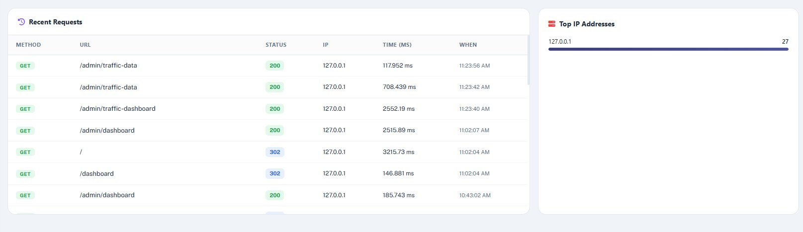

<p align="center">
  
  
  
  
  
</p>

<h1 align="center">Laravel Traffic Analytics</h1>

<p align="center">
  A powerful, plug-and-play Laravel package for tracking, analyzing, and visualizing your application's HTTP traffic — with a beautiful real-time dashboard, dark mode, CSV export, and zero configuration required.
</p>

---

## Features

-  **Automatic HTTP Traffic Logging** via middleware — zero manual code needed
-  **Beautiful Analytics Dashboard** with real-time charts (Chart.js)
-  **Dark Mode** support with toggle
-  **Flexible Date Filtering** — Today, Last 7 Days, Last 30 Days, Custom Range
-  **Traffic Over Time** line chart with Avg Response Time overlay
-  **Status Code Distribution** doughnut chart (2xx / 3xx / 4xx / 5xx)
-  **Top Visited URLs** with popularity bar chart
-  **HTTP Method Distribution** pie chart (GET / POST / PUT / DELETE)
-  **Top IP Addresses** with hit count
-  **Recent Requests** live log table
-  **CSV Export** for any date range
-  **Auto-refresh** every 15 seconds
-  **Response Caching** for high-traffic sites

---

## Screenshots

### Dashboard Overview — Light Mode


### Dashboard Overview — Dark Mode


### Top Visited URLs & HTTP Methods


### Top URLs Table


### Recent Requests & Top IPs


---

## Installation

### Step 1 — Install via Composer

```bash
composer require Jalismahamud/traffic-analytics
```

### Step 2 — Publish & Run Migrations

```bash
php artisan vendor:publish --tag=traffic-analytics-migrations
php artisan migrate
```

### Step 3 — Register Middleware

**Laravel 11 / 12** — in `bootstrap/app.php`:

```php
->withMiddleware(function (Middleware $middleware) {
    $middleware->append(\Jalismahamud\TrafficAnalytics\Http\Middleware\TrafficLogger::class);
})
```

**Laravel 10** — in `app/Http/Kernel.php`, add to the `$middleware` array:

```php
protected $middleware = [
    // ...
    \Jalismahamud\TrafficAnalytics\Http\Middleware\TrafficLogger::class,
];
```

### Step 4 — Add Routes

Inside your existing admin route group in `routes/web.php`:

```php
use Jalismahamud\TrafficAnalytics\Http\Controllers\TrafficAnalyticsController;

Route::prefix('admin')->middleware(['auth'])->group(function () {
    Route::get('traffic-dashboard', [TrafficAnalyticsController::class, 'dashboard'])->name('admin.traffic.dashboard');
    Route::get('traffic-data',      [TrafficAnalyticsController::class, 'getChartData'])->name('admin.traffic.data');
    Route::get('traffic-export',    [TrafficAnalyticsController::class, 'exportCsv'])->name('admin.traffic.export');
});
```

### Step 5 — Clear Cache

```bash
php artisan config:clear
php artisan cache:clear
php artisan view:clear
```

### Done!

Visit your dashboard at:

```
/admin/traffic-dashboard
```

---

## Configuration (Optional)

Publish the config file to customize behavior:

```bash
php artisan vendor:publish --tag=traffic-analytics-config
```

This creates `config/traffic-analytics.php`:

```php
return [

    /*
    |--------------------------------------------------------------------------
    | Dashboard Route Prefix
    |--------------------------------------------------------------------------
    | The URI prefix for all traffic analytics routes.
    */
    'route_prefix' => 'admin',

    /*
    |--------------------------------------------------------------------------
    | Middleware
    |--------------------------------------------------------------------------
    | Applied to all traffic analytics dashboard routes.
    */
    'middleware' => ['web', 'auth'],

    /*
    |--------------------------------------------------------------------------
    | Cache TTL (seconds)
    |--------------------------------------------------------------------------
    | How long analytics query results are cached.
    */
    'cache_ttl' => 60,

    /*
    |--------------------------------------------------------------------------
    | Skipped File Extensions
    |--------------------------------------------------------------------------
    | Requests for these file types will NOT be logged.
    */
    'skip_extensions' => ['css', 'js', 'png', 'jpg', 'jpeg', 'gif', 'svg', 'ico', 'woff', 'woff2', 'ttf', 'map'],

    /*
    |--------------------------------------------------------------------------
    | Skipped Path Prefixes
    |--------------------------------------------------------------------------
    | Requests starting with these prefixes will NOT be logged.
    */
    'skip_prefixes' => ['_debugbar', 'telescope', 'horizon', 'livewire'],

];
```

---

## Dashboard Sections

| Section | Description |
|---|---|
| **Metric Cards** | Total requests, unique visitors, avg response time, error rate, today's stats |
| **Traffic Over Time** | Line chart showing request volume and avg response time per hour/day |
| **Status Distribution** | Doughnut chart — 2xx success, 3xx redirects, 4xx client errors, 5xx server errors |
| **Top Visited URLs** | Horizontal bar chart of most-hit endpoints |
| **HTTP Methods** | Pie chart breakdown of GET, POST, PUT, PATCH, DELETE |
| **Top URLs Table** | Tabular view with hits, avg response time, and popularity bar |
| **Recent Requests** | Live scrollable log of latest requests with method, status, IP, timing |
| **Top IP Addresses** | Most active IPs with request count and visual bar |

---

## 🔌 Database Schema

The package creates a single `traffic_logs` table:

| Column | Type | Description |
|---|---|---|
| `id` | `bigint` | Auto-increment primary key |
| `url` | `text` | Full request URL |
| `method` | `varchar(10)` | HTTP method (GET, POST, etc.) |
| `ip_address` | `varchar(45)` | Client IP (supports IPv6) |
| `status_code` | `smallint` | HTTP response status code |
| `response_time` | `float` | Response time in milliseconds |
| `user_id` | `bigint` | Authenticated user ID (nullable) |
| `user_agent` | `text` | Browser user agent string |
| `referrer` | `text` | HTTP referrer header |
| `created_at` | `timestamp` | When the request was logged |

---

## Requirements

| Requirement | Version |
|---|---|
| PHP | `^8.1` |
| Laravel | `^10.0 \| ^11.0 \| ^12.0` |
| Database | MySQL / MariaDB (uses `DATE_FORMAT`) |

---

## Sidebar Link (Optional)

Add a link to your admin navigation:

```blade
<a href="{{ route('admin.traffic.dashboard') }}">
    <i class="fa-solid fa-chart-line"></i>
    Traffic Analytics
</a>
```

---

## Uninstalling

```bash
php artisan migrate:rollback --path=database/migrations/2024_01_01_000001_create_traffic_logs_table.php
composer remove Jalismahamud/traffic-analytics
```

---

## Contributing

Contributions are welcome! Please:

1. Fork the repository
2. Create a feature branch: `git checkout -b feature/my-feature`
3. Commit your changes: `git commit -m 'Add some feature'`
4. Push to the branch: `git push origin feature/my-feature`
5. Open a Pull Request

---

## License

This package is open-source software licensed under the [MIT License](LICENSE).

---

<p align="center">
  Made with ❤️ for the Laravel community
</p>